# 🐰 ActiveRabbit Error Tracking - How It Works

## Overview

ActiveRabbit provides comprehensive error tracking and monitoring for your Rails applications. This guide explains exactly how errors are captured, processed, and made actionable for your development team.

## 🔄 Complete Error Tracking Flow

```mermaid
flowchart TD
    A["🚨 Error Occurs in Rails App"] --> B["ActiveRabbit Gem Captures Error"]
    B --> C{"Error Processing"}

    C --> D["📝 PII Scrubbing<br/>Remove sensitive data"]
    C --> E["🔍 Exception Analysis<br/>Extract class, message, backtrace"]
    C --> F["📊 Context Collection<br/>Controller, action, request data"]

    D --> G["📦 Create Error Payload"]
    E --> G
    F --> G

    G --> H["🌐 HTTP POST to API<br/>/api/v1/events/errors"]
    H --> I["🔐 API Authentication<br/>X-Project-Token header"]

    I --> J{"Authentication Valid?"}
    J -->|No| K["❌ 403 Forbidden"]
    J -->|Yes| L["📋 Queue Background Job<br/>Sidekiq"]

    L --> M["⚙️ Background Processing"]
    M --> N["🔄 Generate Fingerprint<br/>Group similar errors"]

    N --> O{"Issue Exists?"}
    O -->|No| P["📝 Create New Issue<br/>status: open, count: 1"]
    O -->|Yes| Q["📈 Update Existing Issue<br/>increment count, update timestamps"]

    P --> R["💾 Save to Database<br/>PostgreSQL"]
    Q --> R

    R --> S["📧 Check Alert Rules<br/>Should we notify?"]
    S --> T["🔔 Send Notifications<br/>(Email, Slack, etc.)"]

    R --> U["📊 Admin Dashboard<br/>Real-time error display"]
    T --> U

    U --> V["👨‍💻 Developer Views Error<br/>http://localhost:3000/admin/errors"]
    V --> W["🛠️ Developer Actions<br/>Mark as WIP, Resolved, Delete"]
```



## 📋 Detailed Flow Breakdown

### Phase 1: 🚨 Error Capture (Rails App)

**What happens when an error occurs in your Rails application:**

1. **Error Occurs**: Any unhandled exception in your Rails app
   - Controller errors
   - Model validation failures
   - Database connection issues
   - Third-party API failures

2. **ActiveRabbit Gem Intercepts**:
   - Middleware automatically captures exceptions
   - No code changes required in your application
   - Works with all types of Rails errors

3. **Data Processing**:
   ```ruby
   # Error data extraction
   error_data = {
     class: exception.class.name,           # "StandardError"
     message: exception.message,            # "User not found"
     backtrace: exception.backtrace,        # Full stack trace
     context: {
       controller: "UsersController",
       action: "show",
       request_id: request.uuid,
       user_id: current_user&.id,
       params: scrubbed_params
     }
   }
   ```

4. **🔒 PII Scrubbing**: Automatically removes sensitive data:
   - Email addresses → `[EMAIL]`
   - Credit card numbers → `[CREDIT_CARD]`
   - Phone numbers → `[PHONE]`
   - Custom PII fields you configure

### Phase 2: 🌐 API Transmission

5. **HTTP Request**: Gem sends secure POST request
   ```bash
   POST http://your-activerabbit-app.com/api/v1/events/errors
   Content-Type: application/json
   X-Project-Token: your-api-token
   ```

6. **Payload Structure**:
   ```json
   {
     "error": {
       "class": "ActiveRecord::RecordNotFound",
       "message": "Couldn't find User with 'id'=999",
       "backtrace": [
         "app/controllers/users_controller.rb:42:in `show'",
         "actionpack/lib/action_controller/metal/basic_implicit_render.rb:8:in `send_action'",
         "..."
       ],
       "context": {
         "controller": "UsersController",
         "action": "show",
         "request_id": "abc123-def456",
         "user_agent": "Mozilla/5.0...",
         "ip_address": "192.168.1.1",
         "occurred_at": "2024-01-15T10:30:00Z"
       }
     }
   }
   ```

7. **🔐 Authentication**: API validates the project token
   - Each Rails app has unique API token
   - Ensures only authorized apps can send data
   - Failed auth returns 403 Forbidden

### Phase 3: ⚙️ Background Processing

8. **Sidekiq Job Queued**: API immediately queues background job
   - Non-blocking processing
   - Ensures fast API response times
   - Handles high error volumes

9. **🔄 Error Fingerprinting**: Creates unique identifier
   ```ruby
   # Generate fingerprint to group similar errors
   fingerprint = Digest::SHA256.hexdigest([
     error.class.name,
     error.backtrace.first,  # Top frame
     context[:controller_action]
   ].join('|'))
   ```

10. **Issue Management**:
    - **New Error**: Creates new `Issue` record
      ```ruby
      Issue.create!(
        fingerprint: fingerprint,
        exception_class: "ActiveRecord::RecordNotFound",
        sample_message: "Couldn't find User with 'id'=999",
        controller_action: "UsersController#show",
        top_frame: "app/controllers/users_controller.rb:42",
        status: "open",
        count: 1,
        first_seen_at: Time.current,
        last_seen_at: Time.current,
        project: project
      )
      ```
    - **Existing Error**: Updates existing issue
      ```ruby
      issue.update!(
        count: issue.count + 1,
        last_seen_at: Time.current,
        sample_message: latest_message  # Keep most recent
      )
      ```

### Phase 4: 💾 Database Storage

11. **Database Schema**:
    ```sql
    -- Issues table (grouped errors)
    CREATE TABLE issues (
      id SERIAL PRIMARY KEY,
      fingerprint VARCHAR(64) UNIQUE NOT NULL,
      exception_class VARCHAR(255) NOT NULL,
      sample_message TEXT,
      controller_action VARCHAR(255),
      top_frame TEXT,
      status VARCHAR(20) DEFAULT 'open',
      count INTEGER DEFAULT 1,
      first_seen_at TIMESTAMP,
      last_seen_at TIMESTAMP,
      project_id INTEGER REFERENCES projects(id)
    );

    -- Events table (individual occurrences)
    CREATE TABLE events (
      id SERIAL PRIMARY KEY,
      issue_id INTEGER REFERENCES issues(id),
      event_type VARCHAR(50),
      payload JSONB,
      occurred_at TIMESTAMP,
      created_at TIMESTAMP
    );
    ```

### Phase 5: 🔔 Alerting & Notifications

12. **Alert Rules Evaluation**:
    ```ruby
    # Example alert conditions
    if issue.count >= 10 && issue.last_seen_at > 1.hour.ago
      AlertNotificationJob.perform_async(issue.id, 'high_frequency')
    end

    if issue.first_seen_at == issue.last_seen_at  # New error
      AlertNotificationJob.perform_async(issue.id, 'new_error')
    end
    ```

13. **Notification Channels**:
    - 📧 Email alerts to development team
    - 💬 Slack/Discord notifications
    - 📱 SMS for critical errors
    - 🔗 Webhook integrations

### Phase 6: 👨‍💻 Developer Interface

14. **Admin Dashboard**: `http://your-app.com/admin/errors`
    - **Overview**: Total errors, open issues, recent activity
    - **Error List**: Grouped by issue with counts and timestamps
    - **Search & Filter**: By error class, controller, date range
    - **Real-time Updates**: Live error feed

15. **Error Details Page**: Click any error to see:
    ```
    🐰 ActiveRecord::RecordNotFound

    📊 Statistics:
    • Count: 23 occurrences
    • First seen: 2 days ago
    • Last seen: 5 minutes ago
    • Status: Open

    📝 Sample Message:
    "Couldn't find User with 'id'=999"

    🔍 Stack Trace:
    app/controllers/users_controller.rb:42:in `show'
    actionpack/.../basic_implicit_render.rb:8:in `send_action'
    ...

    📋 Context:
    • Controller: UsersController#show
    • Request ID: abc123-def456
    • User Agent: Mozilla/5.0...
    • IP Address: 192.168.1.1

    🕐 Recent Occurrences:
    • 5 minutes ago
    • 1 hour ago
    • 3 hours ago
    ```

16. **Developer Actions**:
    - **🟡 Mark as WIP**: Currently investigating
    - **🟢 Mark as Resolved**: Fixed and deployed
    - **🗑️ Delete**: Remove from tracking
    - **📧 Subscribe**: Get notifications for this error
    - **🔗 Create Issue**: Link to GitHub/Jira ticket

## 🚀 Key Features

### **Automatic Error Capture**
- Zero configuration required
- Catches all Rails exceptions
- Works with background jobs (Sidekiq)
- Captures performance issues

### **Smart Error Grouping**
- Similar errors grouped together
- Reduces noise in your dashboard
- Focus on unique issues, not spam

### **Privacy & Security**
- Automatic PII scrubbing
- Configurable sensitive fields
- Secure API token authentication
- On-premise deployment option

### **Performance Optimized**
- Asynchronous processing
- Non-blocking error capture
- Minimal impact on app performance
- Handles high-volume applications

### **Developer Friendly**
- Rich error context
- Full stack traces
- Request information
- Easy issue management workflow

## 🛠️ Setup Instructions

### 1. Add the Gem
```ruby
# Gemfile
gem 'active_rabbit-client'
```

### 2. Configure
```ruby
# config/initializers/active_rabbit.rb
ActiveRabbit::Client.configure do |config|
  config.api_key = ENV['ACTIVERABBIT_API_KEY']
  config.project_id = 'your-rails-app'
  config.api_url = 'https://your-activerabbit-app.com'

  # Optional: Custom PII fields
  config.pii_fields += %w[internal_id secret_token]

  # Optional: Ignore certain exceptions
  config.ignored_exceptions += %w[ActionController::RoutingError]
end
```

### 3. Deploy & Monitor
- Deploy your Rails app with the gem
- Errors automatically start flowing to ActiveRabbit
- Monitor via the admin dashboard
- Set up alert rules for your team

## 🔧 Advanced Configuration

### Custom Error Handling
```ruby
# Manual error tracking
begin
  risky_operation
rescue => e
  ActiveRabbit::Client.track_exception(e, {
    context: 'manual_tracking',
    user_id: current_user.id
  })
  raise
end
```

### Performance Monitoring
```ruby
# Track slow operations
ActiveRabbit::Client.track_performance(
  'database_query',
  duration_ms: 1500,
  metadata: { query_type: 'complex_join' }
)
```

### Custom Callbacks
```ruby
ActiveRabbit::Client.configure do |config|
  config.before_send_exception = proc do |exception_data|
    # Add custom metadata
    exception_data[:deployment_version] = ENV['APP_VERSION']
    exception_data[:feature_flags] = current_feature_flags
    exception_data
  end
end
```

## 📊 Monitoring Best Practices

1. **Set Up Alerts**: Configure notifications for critical errors
2. **Regular Review**: Weekly error review meetings
3. **Trend Analysis**: Monitor error rates over time
4. **Performance Tracking**: Watch for N+1 queries and slow operations
5. **Team Workflow**: Assign and track error resolution

## 🆘 Troubleshooting

### Common Issues

**Errors not appearing in dashboard:**
- Check API key configuration
- Verify network connectivity
- Check Sidekiq is running
- Review Rails logs for gem errors

**High error volume:**
- Review ignored_exceptions list
- Check for error loops
- Implement proper error handling

**Missing context data:**
- Ensure middleware is properly loaded
- Check Rails version compatibility
- Verify ActiveRabbit gem version

### Support

- 📚 Documentation: [ActiveRabbit Docs](https://github.com/activerabbit/active_rabbit-client)
- 🐛 Issues: [GitHub Issues](https://github.com/activerabbit/active_rabbit-client/issues)
- 💬 Community: [Discord Server](https://discord.gg/activerabbit)

---

**ActiveRabbit** - Comprehensive error tracking and monitoring for Rails applications 🐰
